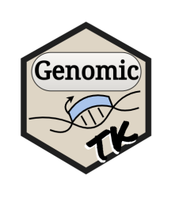

<!-- README.md is generated from README.Rmd. Please edit that file -->

# GenomicTK <a href='https://nchanard.github.io/GenomicTK/'></a>

<!-- badges: start -->

[](https://github.com/NChanard/GenomicTK/actions/workflows/R-CMD-check.yaml)
[](https://app.codecov.io/gh/NChanard/GenomicTK?branch=master)
<!-- badges: end -->

GenomicTK is a Set of genomic data manipulation tools.

## Installation

You can install the development version of GenomicTK from
[GitHub](https://github.com/) with:

``` r
remotes::install_github("NChanard/GenomicTK")
```

## Documentation

[GenomicTK](https://nchanard.github.io/GenomicTK/)
